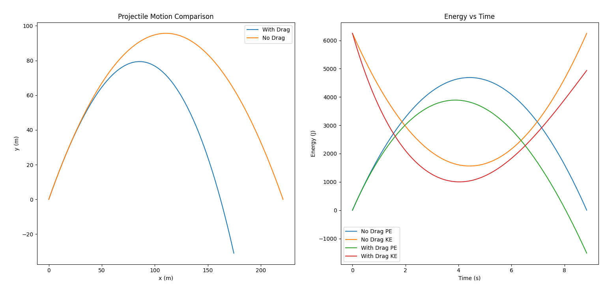

# Projectile Motion Simulator with Drag

- KEY FEATURES
  - trajectory visualization
  - kinetic/potential energy graphs
  - drag force simulation
  - numerical time-step integration[Euler Integration]

- Libraries Used
  - matplotlib
  - math

- Concepts Used
  - Newotnian Mechanics
  - Vector Maths
  - Air Resistance
  - Euler Integration

- Formuale Used
  - Time of Flight
    - T = 2vy / g
  - Resultant Velocity
    - v = √(vx² + vy²)
  - Kinetic Energy
    - KE = 1/2mv²
  - Potential Energy
    - PE = mgh
  - Drag Force
    - Fd = 1/2CdρAv²
  - Cross Sectional Area
    - A = pi*r²
  - Drag Force Components
    - Fx = -Fd(vx / v)
    - Fy = -Fd(vy / v)
  - Newton Second Law
    - a = F / m
  - Position Update (Euler Method)
    - xnew = xold + vx*dt
    - ynew = yold + vy*dt
  - Velocity Update (Euler Method)
    - vnew = vold + a*dt

- HOW TO RUN
  - Make Sure Ncessary Libaries Are installed:
    1. pip install matplotlib
- Run The main File:
  1. python Projectile_sim.py
  2. sometimes Windows may act up with python use this comand instead py Projectile_sim.py
  Make sure to eb in correct directory beofre running the file

- SCREENSHOTS
  - 

